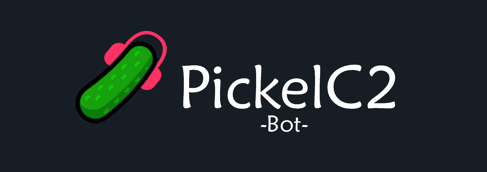
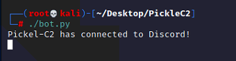
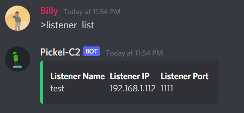
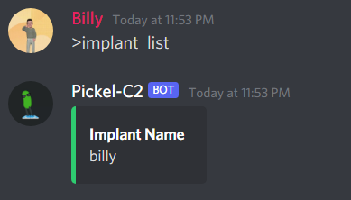
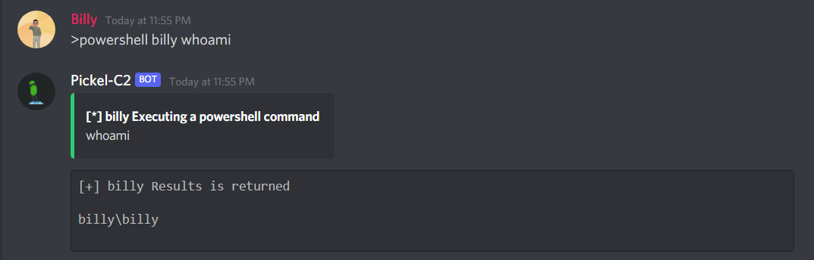
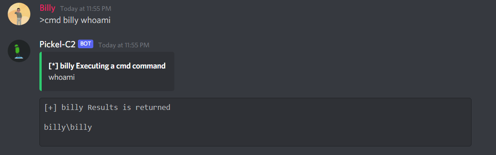
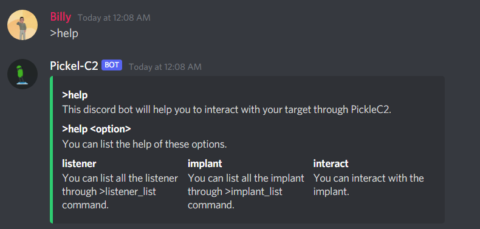
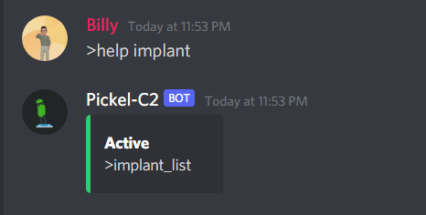
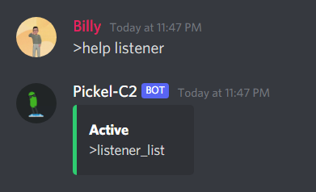
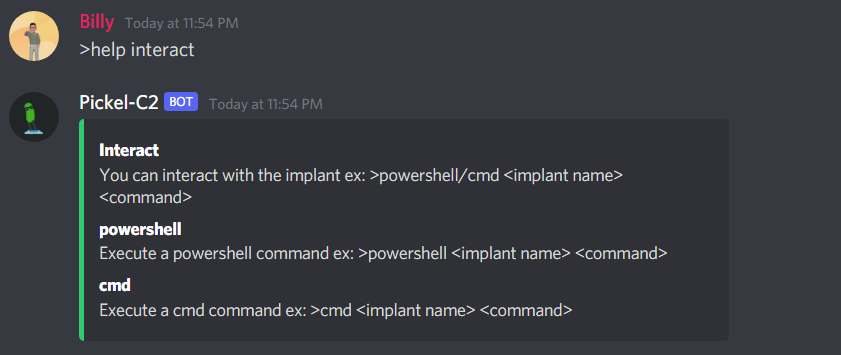

# PickleC2-Bot
This discord bot will help you to control your target through PickleC2 


# WHAT's a PickleC2?

PickleC2 is a simple C2 framework written in python3 used to help the community in Penetration Testers in their red teaming engagements.

PickleC2 has the ability to import your own PowerShell module for Post-Exploitation and Lateral Movement or automate the process.

[Check it out](https://github.com/xRET2pwn/PickleC2)

# USAGE

## List Listeners


## List Implants

## Interact

### Powershell



### CMD



## Help

In the help option you can see the help of the functions


### Help Implant



### Help listener



### Help Interact




# INSTALLATION

You have two options to download the PickleC2-Bot feel free to use anyone of them. 

NOTE: The import thing is you need to put **bot.py** in the PickleC2 Folder.

## Oneline

You can install PickleC2-Bot directly through the following command

```
echo "Enter the PickleC2 Folder: ";read PickleC2Path;wget https://raw.githubusercontent.com/Sh4d3-Pwn3r/PickleC2-Bot/main/bot.py -O $PickleC2Path/bot.py;chmod +x $PickleC2Path/bot.py
```

## Normal Installation

You also can install the PickleC2-Bot through the following commands
```
cd {PickleC2_Path}
git clone https://github.com/Sh4d3-Pwn3r/PickleC2-Bot.git
chmod +x bot.py
```

NOTE: After installing the script, you'll need to create a discord dev account to generate a bot token then you'll have to put it in the **bot.py**

Happy Hacking :)
